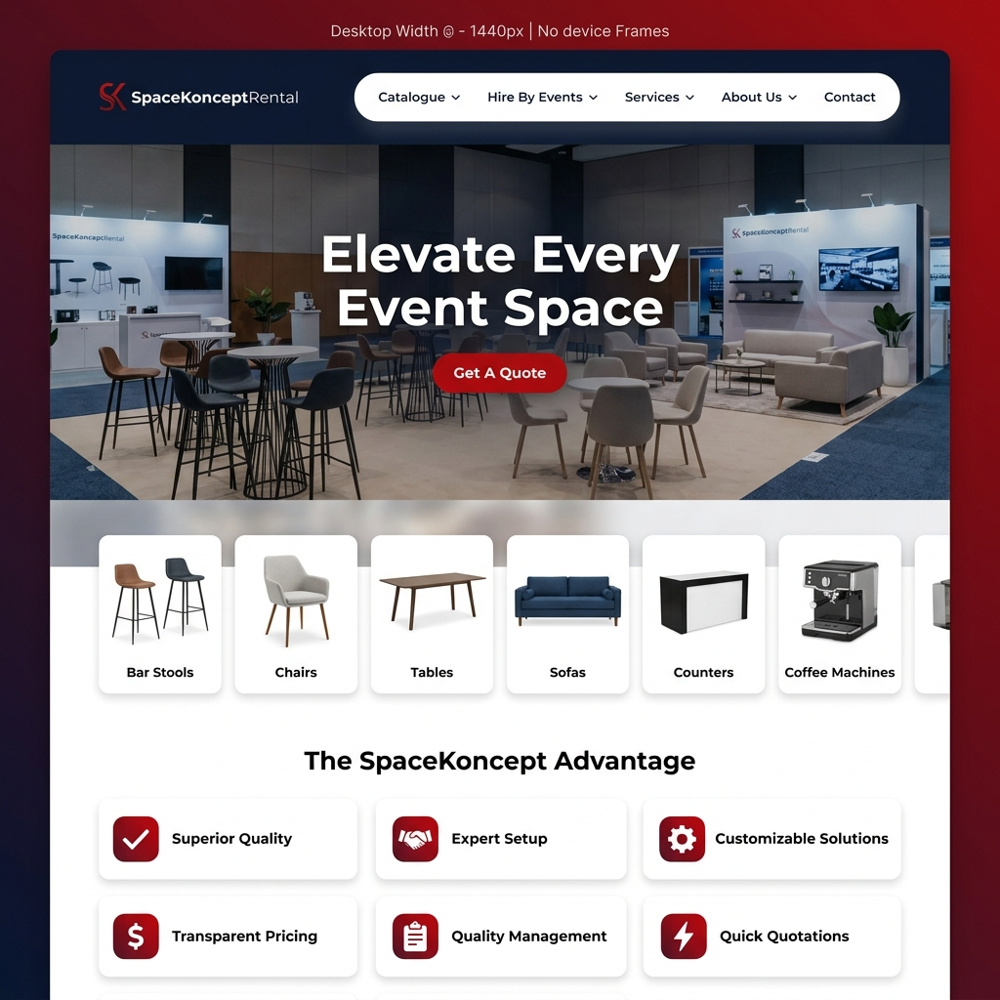
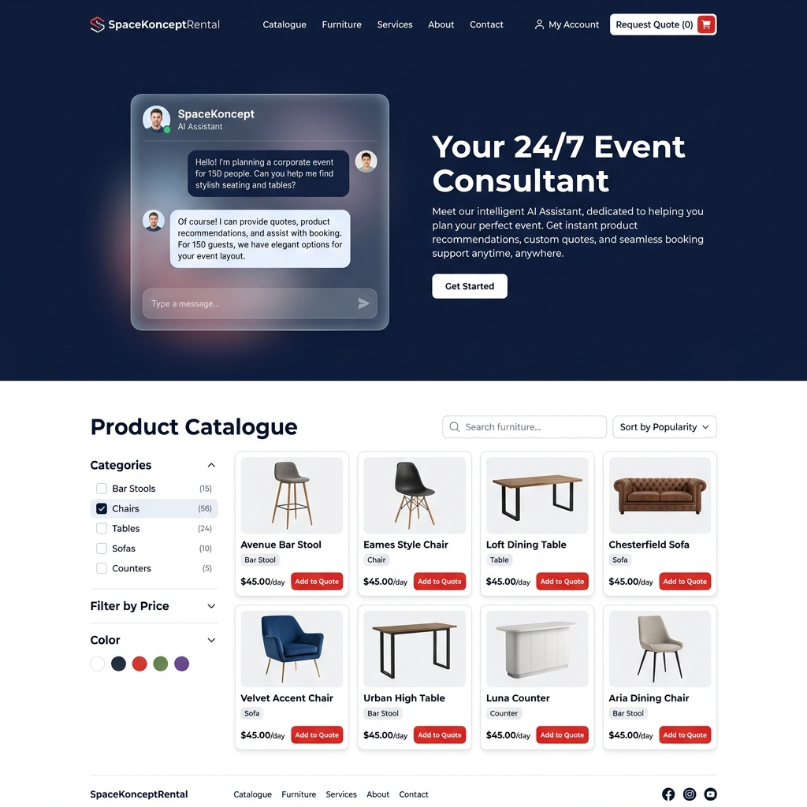
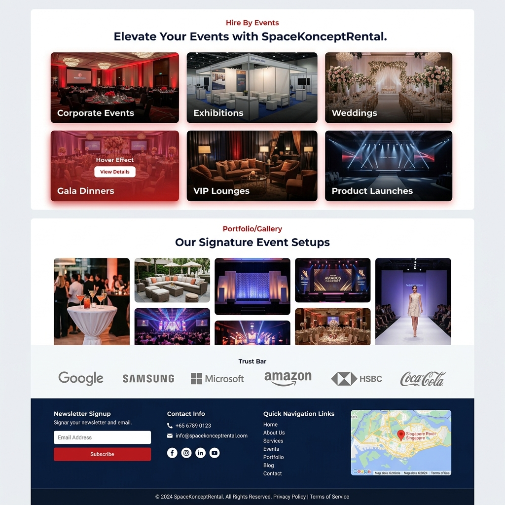
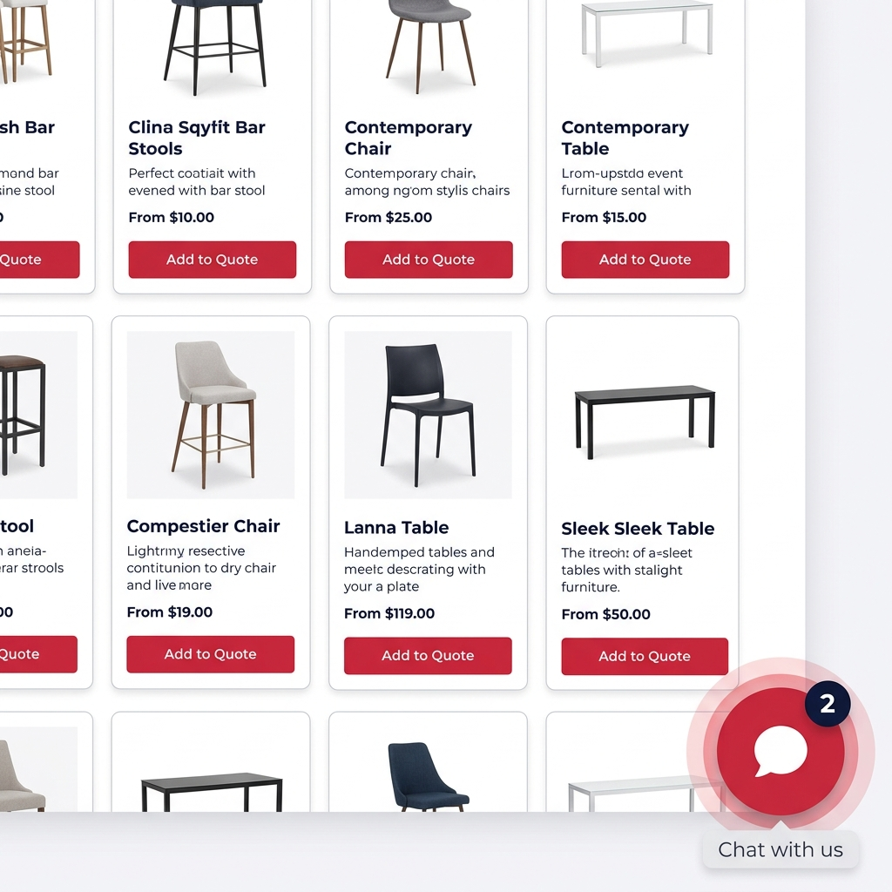
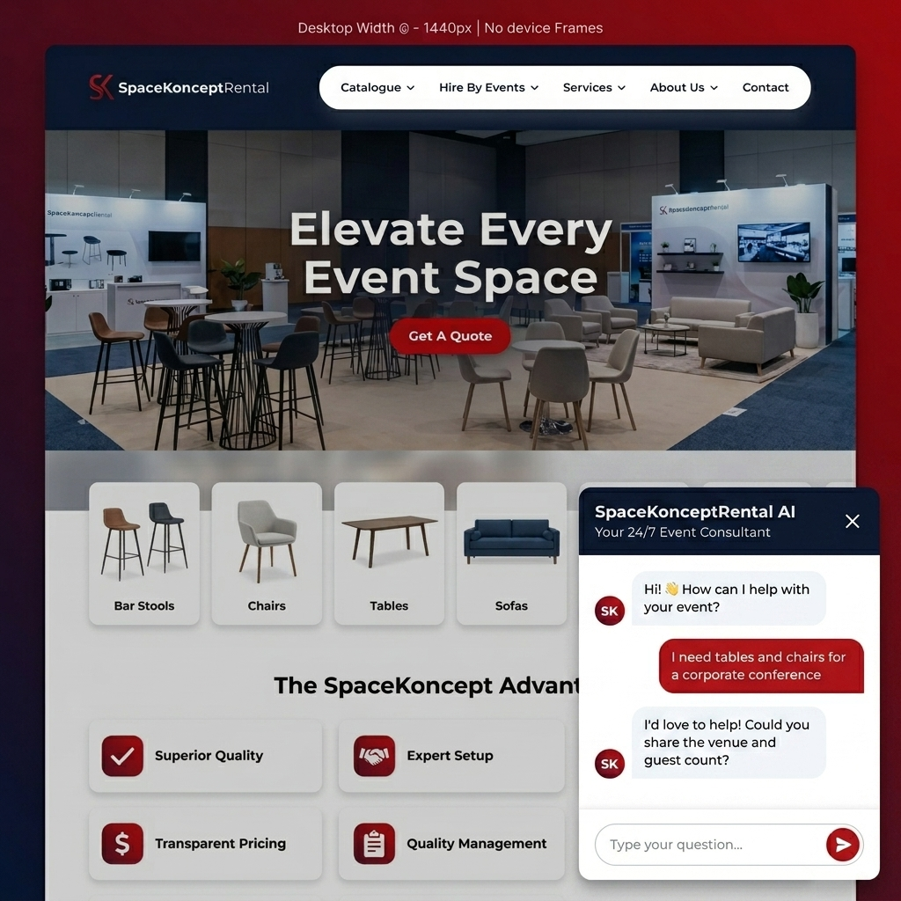
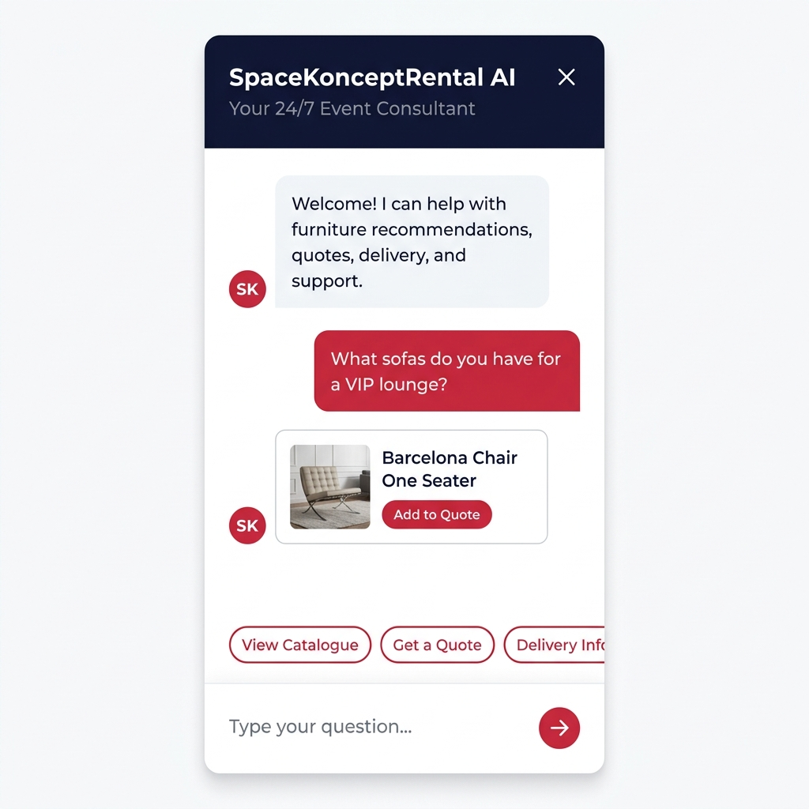

# SpaceKonceptRental - Premium Rental Website Blueprint

## Goal

Transform SpaceKonceptRental from a single-page capstone demo into a full-featured, premium rental website that matches (and exceeds) the competitor [Events Partner](https://eventspartner.com.sg/) - with a custom AI chatbot powered by the existing n8n workflow.

---

## Concept Mockups

### Homepage Hero & Advantage Cards



### AI Chatbot & Product Catalogue



### Events, Portfolio & Footer



---

## Competitor Analysis: Events Partner Features

| Feature | Events Partner | SpaceKonceptRental (Planned) |
|---|---|---|
| Hero banner carousel | Yes (6 slides, Owl Carousel) | Yes - fullscreen video/image carousel with parallax |
| Mega-menu navigation | Yes (Catalogue, Events, Services, About) | Yes - same structure adapted for SKR categories |
| Product catalogue with categories | Yes (WooCommerce, 12+ categories) | Yes - static JSON-driven catalogue with quote cart |
| Search (product search) | Yes (Advanced Woo Search) | Yes - client-side instant search with fuzzy matching |
| Hire By Events page | Yes (12 event types) | Yes - event type cards with curated furniture sets |
| Portfolio / Gallery | Yes | Yes - masonry gallery with lightbox |
| Insights Lab / Blog | Yes | Phase 2 |
| Downloads (PDF catalogue) | Yes | Yes - downloadable PDF catalogue link |
| User accounts / Cart | Yes (WooCommerce) | Replaced by quote-request flow + chatbot |
| Side cart / Wishlist | Yes | Quote basket (simplified) |
| Live chat (Tawk.to) | Yes | **Custom AI chatbot** (n8n-powered, our differentiator) |
| Announcement bar | Yes (rotating) | Yes |
| Newsletter signup | Yes (Mailchimp) | Yes |
| Social proof / Reviews | Yes (4.9 rating, 419 reviews) | Yes - testimonials carousel |
| Contact form | Yes | Yes + integrated into chatbot |
| WhatsApp link | Yes | Yes |
| Instagram feed embed | Yes (SBI plugin) | Yes |
| Fleet / Delivery rates page | Yes | Yes |
| FAQ page | Yes | Yes + chatbot-powered FAQ |
| Space Planning & Styling | Yes | Yes |
| Mobile responsive | Yes | Yes - mobile-first approach |
| SEO (Schema, meta) | Yes (Rank Math, LocalBusiness schema) | Yes - full structured data |

---

## Design System

### Color Palette

| Token | Value | Usage |
|---|---|---|
| `--navy` | `#10142d` | Header, footer, dark sections |
| `--navy-light` | `#1c2430` | Text on light backgrounds |
| `--crimson` | `#d72f45` | Primary CTA, accents, icon backgrounds |
| `--crimson-dark` | `#9f2234` | Hover states, active states |
| `--teal` | `#1ea995` | Secondary accent, success states |
| `--white` | `#ffffff` | Card backgrounds, text on dark |
| `--paper` | `#f6f8fb` | Page background |
| `--smoke` | `#edf1f6` | Section alternating background |
| `--muted` | `#5a6675` | Body text, captions |
| `--line` | `#d9dee6` | Borders, dividers |

### Typography

- **Primary font**: `Montserrat` (matching competitor's choice, clean for furniture/events)
- **Secondary font**: `Inter` (UI elements, body text)
- **Headings**: Montserrat 700-900, tracked tight
- **Body**: Inter 400-500, 16-18px, 1.6 line-height

### Design Elements (inspired by the attached "Tenplusage Advantage" image)

- **Advantage cards**: White cards with red top-border accent, rounded corners, red icon circles, bold headings, descriptive text
- **CTA buttons**: Pill-shaped with arrow circle on right edge (matching competitor style)
- **Hover effects**: Card lift with shadow deepening, color transitions
- **Animations**: AOS (Animate on Scroll) for section reveals, subtle parallax on hero

---

## Site Architecture

```mermaid
graph TD
    A["Homepage"] --> B["Catalogue"]
    A --> C["Hire By Events"]
    A --> D["Services"]
    A --> E["About Us"]
    A --> F["Contact Us"]
    A --> G["Portfolio"]
    
    B --> B1["Bar Stools"]
    B --> B2["Chairs"]
    B --> B3["Tables"]
    B --> B4["Sofas"]
    B --> B5["Counters"]
    B --> B6["Coffee Machines"]
    B --> B7["AV Equipment"]
    B --> B8["Plants & Decor"]
    
    C --> C1["Corporate Events"]
    C --> C2["Exhibitions"]
    C --> C3["Weddings"]
    C --> C4["Product Launches"]
    C --> C5["Gala Dinners"]
    C --> C6["VIP Lounges"]
    
    D --> D1["Space Planning"]
    D --> D2["Custom Branding"]
    D --> D3["Setup & Teardown"]
    
    E --> E1["About SKR"]
    E --> E2["FAQ"]
    E --> E3["Fleet Rates"]
    E --> E4["Payment Methods"]
    
    style A fill:#d72f45,color:#fff
    style B fill:#10142d,color:#fff
    style C fill:#10142d,color:#fff
```



---

## Page-by-Page Specifications

### 1. Homepage (`index.html`)

| Section | Description |
|---|---|
| **Announcement bar** | Rotating ticker with latest news/promotions |
| **Sticky header** | Logo, mega-menu nav, search icon, quote cart icon, WhatsApp shortcut |
| **Hero carousel** | Full-width slides with event photos, headline text, CTA buttons |
| **Category strip** | Horizontal scrolling cards for each product category |
| **SpaceKoncept Advantage** | 3x2 grid of advantage cards (from your attached image, rebranded) |
| **Featured products** | 4-column grid of highlighted rental items |
| **Event types showcase** | Visual cards linking to "Hire By Events" |
| **Testimonials** | Carousel with client quotes and ratings |
| **Client trust bar** | Logo strip of past clients |
| **Newsletter + CTA** | Email signup and "Get A Quote" CTA |
| **AI Chatbot widget** | Floating chat bubble (bottom-right) linking to n8n |
| **Footer** | Contact info, nav links, social icons, Google Maps, copyright |

### 2. Catalogue Page (`catalogue.html`)

- Category filter sidebar (collapsible on mobile)
- Product grid (4 columns desktop, 2 mobile)
- Each card: image, name, category tag, "Add to Quote" button
- Instant search bar with fuzzy matching
- Products loaded from `products.json` data file
- Quote basket floating counter in header

### 3. Hire By Events Page (`events.html`)

- Full-width grid of event type cards with overlay text
- Each event type links to a filtered catalogue view
- Event types: Corporate, Exhibitions, Weddings, Conferences, Gala Dinners, VIP Lounges, Product Launches, Networking Events, Award Ceremonies, Festivals

### 4. Product Detail Page (`product.html?id=...`)

- Large product image gallery
- Product specs, dimensions, colors
- "Add to Quote" button
- Related products carousel
- "Ask about this item" quick-chat link (opens chatbot with context)

### 5. Quote Request Page (`quote.html`)

- Cart-style list of selected items with quantities
- Event details form (date, venue, timing, setup/teardown)
- Delivery preferences
- Submit sends data through n8n webhook for lead capture

### 6. About Us (`about.html`)

- Company story and mission
- Team section
- Certifications / accreditations
- Sustainability commitment

### 7. Contact Us (`contact.html`)

- Contact form (routed through n8n)
- Google Maps embed
- Phone, email, WhatsApp links
- Office hours
- Address with directions

### 8. FAQ (`faq.html`)

- Accordion-style FAQ from knowledge base
- "Can't find an answer?" links to chatbot
- Categories: Booking, Delivery, Pricing, Products, Returns

### 9. Portfolio (`portfolio.html`)

- Masonry photo gallery with lightbox
- Category filters by event type
- Client testimonials interspersed

### 10. Fleet & Delivery Rates (`delivery.html`)

- Pricing table by vehicle type, time window, order value
- Delivery zones map
- Self-collection information

---

## n8n Chatbot Integration Strategy

### Phase 1: Enhanced Floating Widget (Current n8n chat, restyled)

The chatbot lives as a **floating widget** pinned to the bottom-right corner of every page (similar to Tawk.to on the competitor site). It is NOT a dedicated page or embedded section.

#### Visual Mockups

````carousel
**Collapsed State** - The default state on every page. A crimson bubble with pulse animation sits in the bottom-right corner, inviting users to chat.


<!-- slide -->
**Expanded State (Desktop)** - Clicking the bubble opens a ~400x550px floating chat window. Navy header, white message area, crimson accents. The website remains fully visible behind.


<!-- slide -->
**Mobile View** - On mobile, the chat expands to a near-fullscreen overlay with quick-reply chips and inline product cards for a rich conversational experience.


````

#### Widget Behavior

| State | Behavior |
|---|---|
| **Collapsed** | Crimson circle (64px) with chat icon, pulse glow animation, unread badge counter |
| **Expanded (Desktop)** | ~400px wide, ~550px tall floating window with drop shadow, close button to collapse |
| **Expanded (Mobile)** | Near-fullscreen overlay (~90% viewport), swipe-down to dismiss, quick-reply chips |
| **Transition** | Smooth scale + fade animation between collapsed and expanded states |
| **Persistence** | Conversation persists across page navigations via `localStorage` session |

#### Styling

- Custom CSS overrides for the n8n chat widget
- Navy header bar, crimson send button, white message area
- Matches the website's design system exactly
- Chat window has rounded corners + drop shadow for floating feel

### Phase 2: Custom Chat UI (Own frontend, n8n webhook backend)

Replace the n8n chat widget entirely with our own chat component:

- Custom `ChatWidget` class in vanilla JS
- Sends messages to the n8n webhook endpoint via `fetch()`
- Receives responses and renders them with our own markup
- Rich message support: product cards, quick-reply buttons, image carousels
- Session management via `localStorage`
- Typing indicators, read receipts
- Context-aware: can pre-fill product questions from catalogue pages
- "Ask about this item" deep links from product pages

### Webhook Integration

```
Browser Chat UI  -->  fetch(webhookUrl, { body: message })
                  -->  n8n RAG Customer Support Agent workflow
                  <--  JSON response { text, actions, products }
                  <--  Rendered in custom chat UI
```

The existing n8n workflow already handles:
- RAG knowledge-base answers
- Lead capture to Google Sheets
- Ticket creation
- Email escalation
- Conversation logging

No n8n workflow changes needed for Phase 1. Phase 2 may add structured response parsing.

---

## Technology Stack

| Layer | Technology |
|---|---|
| **Frontend** | Static HTML, vanilla CSS, vanilla JavaScript |
| **Fonts** | Google Fonts (Montserrat, Inter) |
| **Icons** | Font Awesome 6 |
| **Animations** | AOS (Animate on Scroll), CSS transitions |
| **Carousel** | Custom vanilla JS or Swiper.js |
| **Lightbox** | GLightbox (lightweight) |
| **Chat engine** | n8n `@n8n/chat` widget (Phase 1) -> custom JS (Phase 2) |
| **Chat backend** | Existing n8n RAG Customer Support Agent workflow |
| **Data** | Static JSON files for product catalogue |
| **Hosting** | GitHub Pages / Netlify (static site) |
| **SEO** | Schema.org LocalBusiness + Product markup |

---

## Proposed File Structure

```
website/
  index.html                    # Homepage
  catalogue.html                # Product catalogue
  events.html                   # Hire By Events
  product.html                  # Product detail (dynamic)
  quote.html                    # Quote request / cart
  about.html                    # About Us
  contact.html                  # Contact page
  faq.html                      # FAQ
  portfolio.html                # Portfolio / Gallery
  delivery.html                 # Fleet & Delivery Rates
  css/
    variables.css               # Design tokens
    base.css                    # Reset, typography, utilities
    components.css              # Cards, buttons, forms, badges
    layout.css                  # Header, footer, grid, sections
    pages.css                   # Page-specific styles
    chat.css                    # Chatbot widget overrides
    responsive.css              # Media queries
  js/
    app.js                      # Main app, navigation, scroll effects
    catalogue.js                # Product filtering, search, rendering
    chat.js                     # Chat widget init + custom UI (Phase 2)
    quote-cart.js               # Quote basket management
    gallery.js                  # Portfolio lightbox
    animations.js               # AOS init, parallax, counters
  data/
    products.json               # Product catalogue data
    events.json                 # Event types data
    testimonials.json           # Client testimonials
    faq.json                    # FAQ entries
  assets/
    images/                     # Product photos, hero images, icons
    logo/                       # Brand assets
    icons/                      # Category icons, UI icons
  chat-config.js                # n8n webhook URL (gitignored)
  chat-config.example.js        # Example config
```

---

## User Review Required

> [!IMPORTANT]
> **Branding assets needed**: We will need the SpaceKonceptRental logo (SVG preferred), brand guidelines if any, and any existing product photography. The generated concept images use placeholder visuals.

> [!IMPORTANT]
> **Product data**: The catalogue currently lives in the knowledge base markdown files. We need to decide whether to manually curate `products.json` with real product photos, or generate it. Real product photos are essential for a premium feel.

> [!IMPORTANT]
> **Domain and hosting**: Where will this be hosted? GitHub Pages, Netlify, or a custom domain? This affects the chat webhook URL configuration.

## Open Questions

1. **WooCommerce or static?** The competitor uses WooCommerce for actual e-commerce (cart, checkout, payment). Do you want actual online ordering, or is a "quote request" flow sufficient where customers select items and submit for a custom quote?

2. **Product photos**: Do you have professional product photography, or should we use placeholder/AI-generated images for the initial build?

3. **WhatsApp integration**: The competitor links to WhatsApp. Should we add a WhatsApp click-to-chat button alongside or instead of some chatbot scenarios?

5. **Blog / Insights Lab**: The competitor has a blog section. Is this a priority for launch, or Phase 2?

6. **Instagram feed**: Should we embed a live Instagram feed on the homepage (like the competitor)?

---

## Phased Implementation

### Phase 1: Core Website (Priority)
- Homepage with all sections
- Catalogue page with filtering
- Quote request flow
- AI chatbot widget (restyled n8n)
- Contact page
- About page
- FAQ page
- Responsive design
- SEO fundamentals

### Phase 2: Extended Pages
- Hire By Events page
- Portfolio gallery
- Product detail pages
- Delivery rates page
- Newsletter integration
- Instagram feed embed

### Phase 3: Advanced Chatbot
- Custom chat UI replacing n8n widget
- Rich message cards (product recommendations)
- Context-aware chat from product pages
- Session persistence

---

## Verification Plan

### Automated Tests
- HTML validation (W3C validator)
- Lighthouse audit (Performance, SEO, Accessibility targets: 90+)
- CSS validation
- Link checking
- Mobile responsive testing via Chrome DevTools

### Manual Verification
- Cross-browser testing (Chrome, Firefox, Safari, Edge)
- Mobile device testing (iOS Safari, Android Chrome)
- Chat widget functionality with live n8n webhook
- Quote request flow end-to-end
- All navigation links working
- Image optimization and lazy loading
- Accessibility (keyboard navigation, screen reader)
