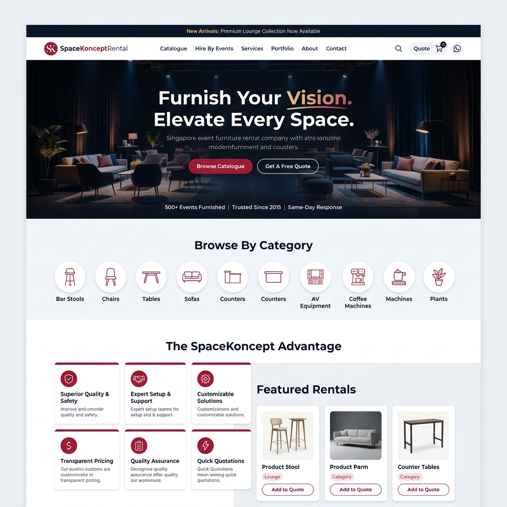
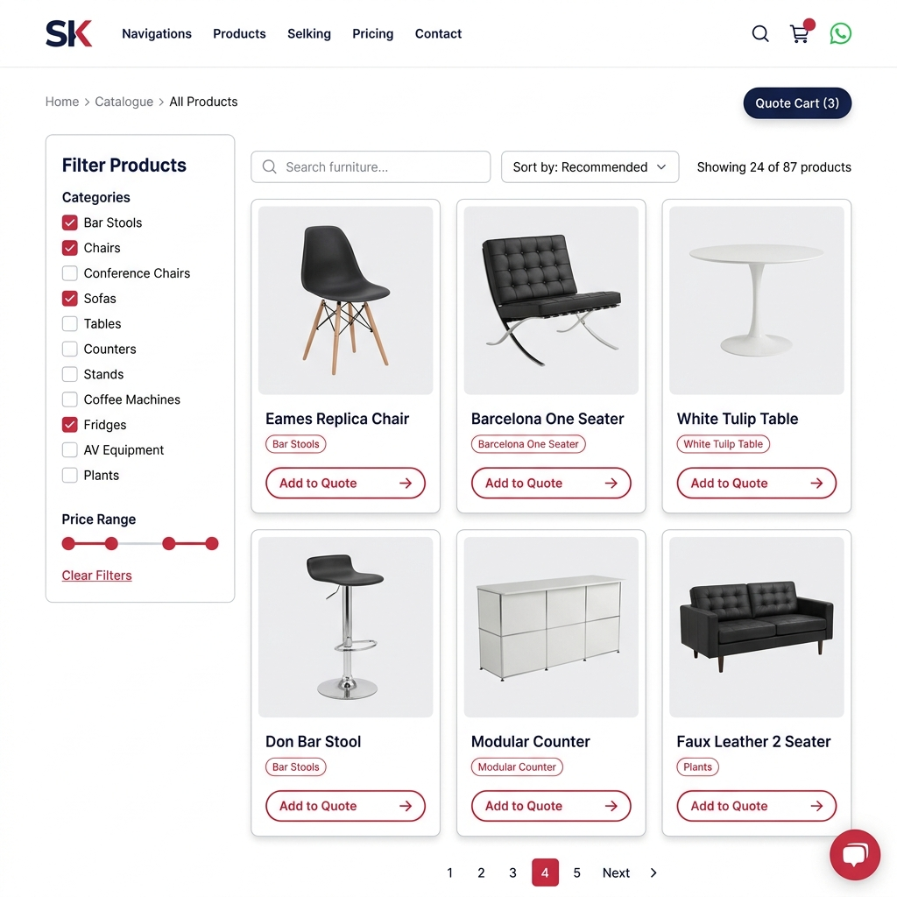
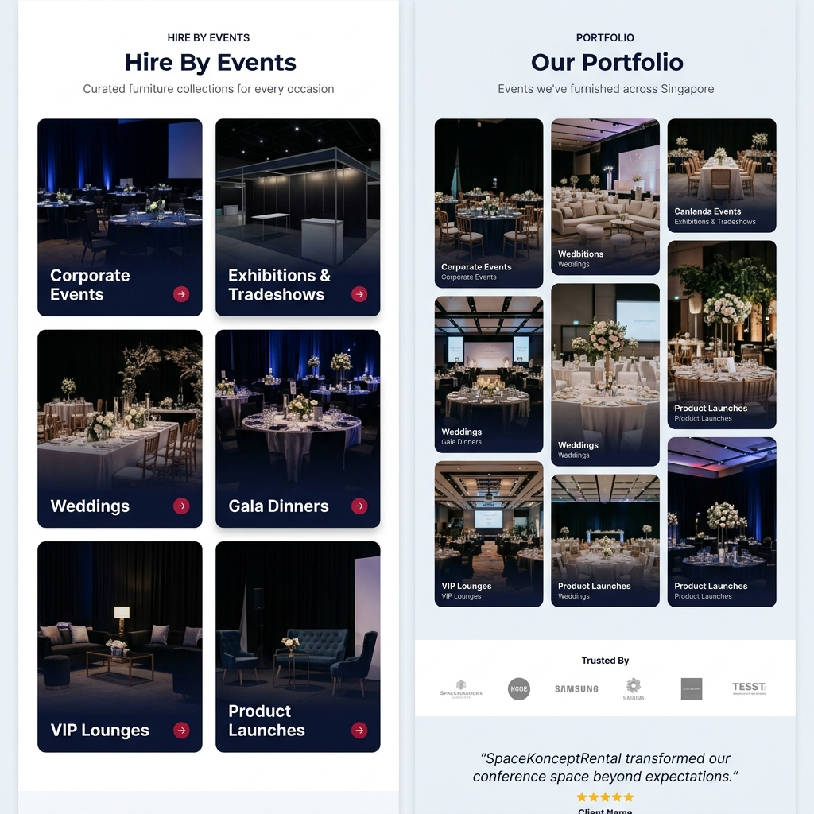
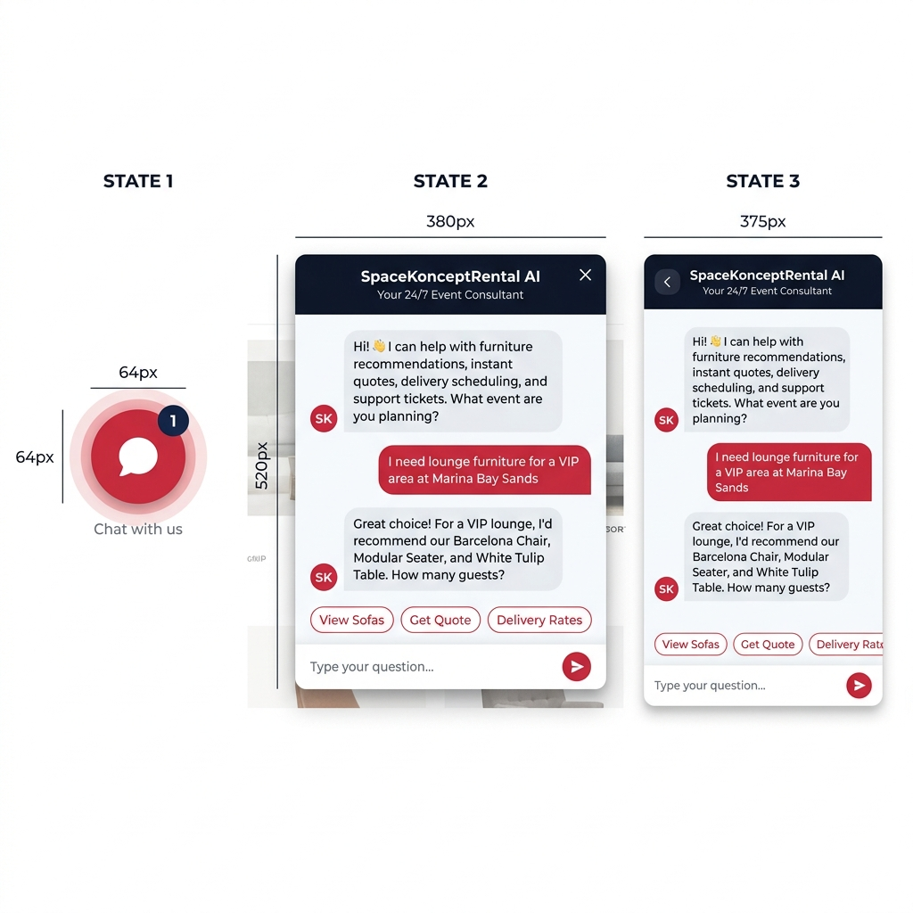
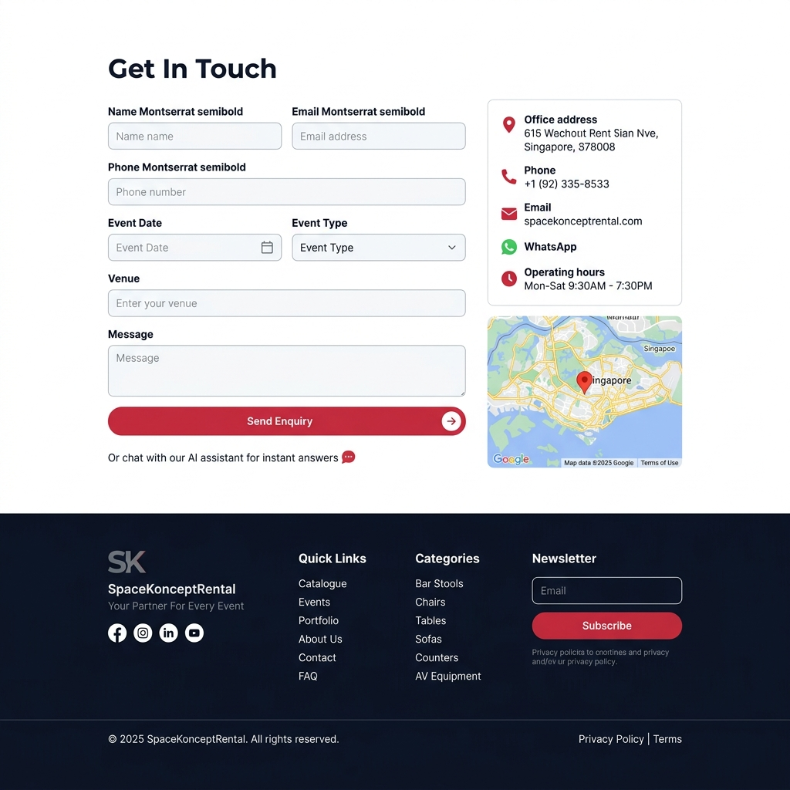
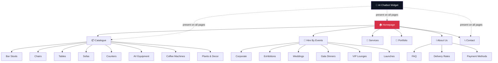

# SpaceKonceptRental — Website Design v2

> Design produced using the Secure UI/UX Frontend Design skill workflow.

---

## Superseded Architecture Note

This document still contains useful visual direction, page structure, design
system notes, and mockup references. Its original implementation assumptions
are superseded.

Current source-of-truth docs:

- `docs/ARCHITECTURE.md`
- `docs/PHASE-ROADMAP.md`
- `docs/checklists/PHASE-1-MVP.md`
- `docs/SAFETY-BOUNDARIES.md`
- `docs/ADR/0001-nextjs-supabase-chat-provider.md`

Approved implementation direction:

- `website/` becomes the future Next.js app root deployed by Vercel.
- Supabase becomes the system of record for products, quote requests,
  conversations, messages, auth, storage, RLS, and tenant-ready boundaries.
- Browser chat must use custom chat UI plus first-party `POST /api/chat`.
- The browser must not call n8n directly in the long-term app.
- n8n is a temporary server-side `N8nChatProvider` and automation integration.
- `InternalSaasChatProvider`, RAG/vector work, full admin, and SaaS platform
  work are later phases and are not approved for immediate implementation.
- The old static `@n8n/chat` demo is legacy/reference only until replaced.
- Do not ship the old widget and new custom chat as competing production paths.
- `website/chat-config.js` is gitignored and may contain a local real webhook
  URL. Do not read, print, copy, migrate, commit, expose, or use it as source
  for the new app. The new app reads n8n webhook URLs only from server-side env
  such as `N8N_CHAT_WEBHOOK_URL`.

Phase 1 is deliberately small. It is not "build the full SaaS platform now."

---

## Concept Mockups

### 1. Homepage



### 2. Product Catalogue



### 3. Hire By Events & Portfolio



### 4. AI Chatbot — All States



### 5. Contact Page & Footer



---

## Product Summary

| Field | Value |
|---|---|
| **Product** | SpaceKonceptRental — rental website with AI chatbot |
| **Category** | B2B event furniture rental, Singapore market |
| **Primary user problem** | Finding, comparing, and requesting quotes for event furniture quickly |
| **Primary user action** | Browse catalogue → add items to quote → submit enquiry |
| **Business goal** | Generate qualified leads and quote requests through self-service browsing + AI chatbot |
| **Key constraints** | Superseded: future app is Next.js on Vercel with Supabase and first-party `/api/chat`; n8n is server-side temporary integration only |

## User Segments

| Segment | Need | Risk / accessibility concern |
|---|---|---|
| **Event organisers** | Browse catalogue, request quote, get delivery info | Mobile-first, often on-site at venues |
| **Corporate buyers** | Compare options, download catalogue PDF, bulk enquiries | May use assistive tech, need clear pricing |
| **Agencies / exhibitors** | Quick turnaround, repeat orders, layout advice | Speed and efficiency, keyboard navigation |
| **Walk-in browsers** | Explore categories, understand services | First-time visitors, need trust signals |

## Brand Adjectives

| Adjective | UI Implication |
|---|---|
| **Premium** | Refined spacing, restrained palette, high-quality imagery, deliberate motion |
| **Reliable** | Clear hierarchy, honest copy, strong validation states, trust signals |
| **Modern** | Clean lines, contemporary typography, subtle animations, dark hero sections |
| **Approachable** | Friendly chatbot, clear CTAs, plain language, visible support options |
| **Professional** | Consistent design system, structured layouts, polished component states |

---

## Design System

### Colour Roles

| Role | Token | Value | Usage |
|---|---|---|---|
| Background | `--bg` | `#f6f8fb` | Page base |
| Surface | `--surface` | `#ffffff` | Cards, panels, inputs, chat area |
| Surface alt | `--surface-alt` | `#edf1f6` | Alternating sections, product photo backgrounds |
| Text primary | `--text` | `#0d1321` | Headings, primary body text |
| Text secondary | `--text-muted` | `#5a6675` | Captions, supporting text, placeholders |
| Border | `--border` | `#d9dee6` | Input borders, card borders, dividers |
| Primary action | `--primary` | `#d72f45` | CTAs, active states, chat send, quote buttons |
| Primary hover | `--primary-hover` | `#b82638` | Button hover, link hover |
| Primary light | `--primary-light` | `rgba(215,47,69,0.08)` | Tag backgrounds, light highlights |
| Secondary action | `--secondary` | `#1ea995` | Success indicators, secondary buttons, teal accents |
| Success | `--success` | `#16a34a` | Form success, confirmation |
| Warning | `--warning` | `#d97706` | Attention needed, stock alerts |
| Danger | `--danger` | `#dc2626` | Errors, destructive actions |
| Info | `--info` | `#2563eb` | Neutral guidance, links |
| Focus | `--focus` | `#d72f45` | Keyboard focus ring (2px solid, 2px offset) |
| Disabled | `--disabled` | `#9ca3af` | Disabled controls, preserving readability |
| Header/Footer | `--navy` | `#0d1321` | Header bg, footer bg, dark sections |

### Typography Scale

| Use | Font | Weight | Size | Line Height |
|---|---|---|---|---|
| Display / Hero | Montserrat | 800 | 56-72px | 1.0 |
| Page heading | Montserrat | 700 | 36-42px | 1.15 |
| Section heading | Montserrat | 700 | 24-28px | 1.25 |
| Card heading | Montserrat | 600 | 18-20px | 1.3 |
| Body | Inter | 400 | 16px | 1.6 |
| Body strong | Inter | 500 | 16px | 1.6 |
| Label | Inter | 500 | 14px | 1.4 |
| Caption | Inter | 400 | 13px | 1.4 |
| Button | Montserrat | 600 | 15px | 1.0 |
| Nav link | Montserrat | 500 | 15px | 1.0 |
| Chat message | Inter | 400 | 14px | 1.5 |

### Spacing Scale

`4 · 8 · 12 · 16 · 24 · 32 · 48 · 64 · 96 · 128`

- Cards: 24px internal padding
- Sections: 64-96px vertical padding
- Grid gutters: 24px (desktop), 16px (mobile)
- Form field spacing: 16px between fields

### Radius & Elevation

| Element | Radius | Shadow |
|---|---|---|
| Buttons | 100px (pill) | None |
| Cards | 8px | `0 2px 8px rgba(0,0,0,0.06)` |
| Card hover | 8px | `0 8px 24px rgba(0,0,0,0.10)` |
| Input fields | 6px | None (border only) |
| Chat window | 12px | `0 12px 40px rgba(0,0,0,0.18)` |
| Chat bubble | 50% (circle) | `0 4px 16px rgba(215,47,69,0.3)` |
| Modals | 12px | `0 16px 48px rgba(0,0,0,0.2)` |
| Images | 6px | None |
| Event cards | 8px | `0 4px 12px rgba(0,0,0,0.08)` |

### Component State Rules

| State | Style |
|---|---|
| **Default** | Token colours, standard borders |
| **Hover** | Primary hover colour for buttons; card lift + deeper shadow; underline for links |
| **Focus** | 2px solid `--primary`, 2px offset, visible on all interactive elements |
| **Active/Pressed** | Scale 0.97 transform, darker background |
| **Disabled** | `--disabled` text and border, `cursor: not-allowed`, no opacity reduction below 0.6 |
| **Loading** | Skeleton shimmer for cards; spinner for buttons (disable re-click) |
| **Error** | `--danger` border + icon + message below field |
| **Success** | `--success` border + checkmark + message |
| **Empty** | Centered illustration + helpful copy + primary action CTA |

### Motion Rules

| Transition | Duration | Easing |
|---|---|---|
| Button hover/focus | 200ms | ease-out |
| Card hover lift | 250ms | ease-out |
| Page section reveal (AOS) | 600ms | ease-out |
| Chat open/close | 300ms | cubic-bezier(0.16,1,0.3,1) |
| Dropdown expand | 200ms | ease-out |
| Mobile menu slide | 300ms | ease-in-out |

All motion respects `prefers-reduced-motion: reduce` — disabled when requested.

### Layout Rules

| Breakpoint | Width | Columns | Notes |
|---|---|---|---|
| Mobile | < 640px | 1 | Stack all, hamburger nav, fullscreen chat |
| Tablet | 640-1024px | 2 | Sidebar collapses, 2-col product grid |
| Desktop | 1024-1440px | 3-4 | Full sidebar, 3-col catalogue, floating chat |
| Wide | > 1440px | 4 | max-width 1440px container, centered |

- Page max-width: `1440px`
- Content max-width: `1200px`
- Sidebar: `280px` (catalogue page)
- Grid gutter: `24px`

---

## Site Architecture



---

## Page-Level Overrides

### Homepage (`index.html`)

| Property | Value |
|---|---|
| **Goal** | Establish credibility, showcase range, drive catalogue browsing or quote request |
| **Primary action** | "Browse Catalogue" or "Get A Free Quote" |
| **Audience** | First-time visitors, returning organisers |

| Section | Content | Components |
|---|---|---|
| Announcement bar | Rotating ticker (new arrivals, promotions) | `AnnouncementBar` — navy bg, white text, close button |
| Header | Logo, mega-nav, search, quote cart, WhatsApp | `StickyHeader` — white bg, shrinks on scroll |
| Hero | Cinematic photo, headline, 2 CTAs, trust strip | `HeroCarousel` — full-bleed, dark overlay, parallax |
| Categories | 8 circular icon cards in horizontal scroll | `CategoryStrip` — paper bg, icon+label circles |
| Advantage | 3×2 card grid (from Tenplusage reference) | `AdvantageCard` — white, crimson top-border, icon badge |
| Featured | 4-column product card grid | `ProductCard` — image, name, tag, quote button |
| Events showcase | 3×2 event type photo cards | `EventCard` — photo, gradient overlay, label |
| Testimonials | Carousel of client quotes | `TestimonialSlider` — quote, stars, name |
| Trust bar | Client logo strip | `TrustBar` — grayscale logos |
| Newsletter | Email input + subscribe CTA | `NewsletterForm` — inline input + button |
| Footer | 4-column links, socials, copyright | `Footer` — navy bg |
| Chat widget | Floating bottom-right | `ChatBubble` / `ChatWindow` |

**Mobile behavior**: Hero stacks vertically, categories become swipeable, advantage cards stack to 1-column, products 2-column, hamburger nav.

---

### Catalogue (`catalogue.html`)

| Property | Value |
|---|---|
| **Goal** | Find and select products for a quote |
| **Primary action** | "Add to Quote" on product cards |

| Section | Components |
|---|---|
| Breadcrumb | `Breadcrumb` — Home > Catalogue |
| Sidebar filters | `FilterPanel` — category checkboxes, clear button |
| Search + sort | `SearchBar` + `SortDropdown` |
| Product grid | `ProductCard` × N in 3-col grid |
| Pagination | `Pagination` — numbered, crimson active |
| Empty state | "No products match your filters" + clear filters CTA |
| Loading state | Skeleton card grid (6 shimmer cards) |

**Mobile behavior**: Sidebar collapses into a slide-out drawer triggered by "Filter" button. Grid becomes 2-column.

---

### AI Chatbot Widget (all pages)

````carousel
**Collapsed State** — Default on every page. Crimson circle, chat icon, pulse glow, unread badge.


<!-- slide -->
**Expanded Desktop** — ~380×520px floating window. Navy header, white chat area, crimson send button, quick-reply chips.

**Expanded Mobile** — Near-fullscreen overlay (~92% viewport). Same design, back button, swipe-down to dismiss.
````

| State | Behavior |
|---|---|
| **Collapsed** | 64px crimson circle, white chat icon, pulse glow ring, unread badge counter |
| **Expanded (desktop)** | 380×520px floating window, 12px radius, deep shadow, close X button |
| **Expanded (mobile)** | 92% viewport overlay, back arrow, swipe-down dismiss |
| **Transition** | 300ms scale+fade, `cubic-bezier(0.16,1,0.3,1)` |
| **Persistence** | Conversation persists across navigations via `localStorage` |
| **Context-aware** | "Ask about this item" from product pages pre-fills context |

**Security notes:**
- Long-term chat UI calls first-party `POST /api/chat`, never n8n directly.
- New app reads n8n webhook URL only from server-side env such as
  `N8N_CHAT_WEBHOOK_URL`.
- `website/chat-config.js` is legacy local config and must not be used as source
  for the Next.js app.
- No PII stored in `localStorage` beyond an anonymous session ID.
- Chat input sanitized before display (XSS prevention).
- No provider trace IDs, webhook URLs, n8n internal IDs, n8n errors, or stack
  traces shown to users.

---

### Contact (`contact.html`)

| Property | Value |
|---|---|
| **Goal** | Submit enquiry or find contact details |
| **Primary action** | "Send Enquiry" form submission |

**Form fields:** Name*, Email*, Phone*, Event Date, Event Type (dropdown), Venue, Message*

**Security notes:**
- Forms submit through first-party APIs or server actions, not directly to n8n.
- Client-side validation + honeypot field for spam.
- Success/error states with clear messaging.
- "Or chat with our AI assistant" link below form.

---

### Events (`events.html`)

| Property | Value |
|---|---|
| **Goal** | Browse furniture by event type, get inspiration |
| **Primary action** | Click event card → filtered catalogue |

6 event type cards: Corporate, Exhibitions, Weddings, Gala Dinners, VIP Lounges, Product Launches.

Each card: full-bleed photo, dark gradient overlay, white title, crimson arrow icon. Links to `catalogue.html?event=corporate` etc.

---

### Portfolio (`portfolio.html`)

Masonry gallery with lightbox. Category filter tabs. Client trust bar. Testimonial quotes.

### FAQ (`faq.html`)

Accordion sections from knowledge base. Categories: Booking, Delivery, Pricing, Products, Returns. "Can't find an answer?" opens chatbot.

### About (`about.html`)

Company story, mission, team, certifications, sustainability.

### Delivery Rates (`delivery.html`)

Pricing table by vehicle type, time window, order value. Self-collection info.

---

## Competitor Feature Parity

| Feature | Events Partner | SpaceKonceptRental v2 |
|---|---|---|
| Hero carousel | ✅ Owl Carousel, 6 slides | ✅ Custom carousel, parallax, trust strip |
| Mega-menu navigation | ✅ Bootstrap dropdowns | ✅ CSS mega-menu, category icons |
| Product catalogue + filters | ✅ WooCommerce | ✅ JSON-driven, instant search, sidebar filters |
| Product search | ✅ Advanced Woo Search | ✅ Client-side fuzzy search |
| Hire By Events | ✅ 12 event types | ✅ 6+ event type cards |
| Portfolio | ✅ Gallery | ✅ Masonry + lightbox + filters |
| Downloads (PDF) | ✅ | ✅ Catalogue PDF download |
| Cart / Checkout | ✅ WooCommerce | ⚡ Quote cart → enquiry form (simpler, no payment) |
| Live chat | ✅ Tawk.to (generic) | ⚡ **AI chatbot** (n8n RAG, our differentiator) |
| Announcement bar | ✅ | ✅ |
| Newsletter | ✅ Mailchimp | ✅ |
| Reviews / testimonials | ✅ 4.9 rating | ✅ Testimonial carousel |
| Contact form | ✅ | ✅ + chatbot link |
| WhatsApp | ✅ | ✅ |
| FAQ | ✅ | ✅ + chatbot-powered |
| SEO / Schema | ✅ Rank Math | ✅ Manual structured data |
| Mobile responsive | ✅ | ✅ Mobile-first |
| User accounts | ✅ WooCommerce | ❌ Not needed (quote flow) |
| Side cart / Wishlist | ✅ | ⚡ Quote basket (simplified) |
| Instagram feed | ✅ | Phase 2 |
| Blog | ✅ | Phase 2 |

---

## Technology Stack

| Layer | Technology |
|---|---|
| Frontend | Static HTML, vanilla CSS, vanilla JavaScript |
| Fonts | Google Fonts — Montserrat, Inter |
| Icons | Font Awesome 6 (self-hosted subset) |
| Animations | AOS (Animate on Scroll), CSS transitions |
| Carousel | Swiper.js (lightweight, accessible) |
| Lightbox | GLightbox |
| Chat engine | Phase 1: `@n8n/chat` (restyled) → Phase 2: custom JS |
| Chat backend | Existing n8n RAG Customer Support Agent workflow |
| Data | Static JSON — `products.json`, `events.json`, `faq.json` |
| Hosting | GitHub Pages or Netlify |
| SEO | Schema.org LocalBusiness + Product markup |

### Superseded Technology Stack

The table above is retained as historical design context only. The approved
implementation stack is:

| Layer | Current Direction |
|---|---|
| Frontend | Next.js app under `website/`, deployed on Vercel |
| UI | React components using this design system and prepared assets |
| Chat UI | Custom `ChatWidget`, not long-term `@n8n/chat` |
| Chat API | First-party `POST /api/chat` |
| Chat provider | Server-only `ChatProvider` with `N8nChatProvider` in Phase 1 |
| Future chat provider | `InternalSaasChatProvider` in a later approved phase |
| Data | Supabase system of record for products, quotes, conversations, messages, auth, storage, and RLS |
| n8n | Temporary server-side provider/integration only |
| SEO | Next.js metadata and structured data |

## File Structure

```
website/
  index.html
  catalogue.html
  events.html
  product.html
  quote.html
  about.html
  contact.html
  faq.html
  portfolio.html
  delivery.html
  css/
    tokens.css              # Design system tokens (colours, type, spacing)
    reset.css               # Normalize + base styles
    components.css          # Cards, buttons, forms, badges, accordion
    layout.css              # Header, footer, grid, sections
    pages.css               # Page-specific overrides
    chat.css                # Chatbot widget styles
    responsive.css          # Breakpoint overrides
  js/
    app.js                  # Nav, scroll, AOS init, announcement bar
    catalogue.js            # Filter, search, sort, render products
    chat.js                 # Chat widget init + Phase 2 custom UI
    quote-cart.js            # Quote basket (localStorage)
    gallery.js              # Portfolio lightbox
  data/
    products.json
    events.json
    testimonials.json
    faq.json
  assets/
    images/
    logo/
    icons/
  chat-config.js            # Webhook URL (gitignored)
  chat-config.example.js
```

### Future Next.js File Structure

The static file structure above is retained as historical context only. Do not
scaffold this during Phase 0. Phase 1 should introduce a small Next.js structure
under `website/`, following `docs/checklists/PHASE-1-MVP.md`:

```text
website/
  app/
    page.tsx
    catalogue/
    product/
    events/
    quote/
    api/
      chat/
        route.ts
  components/
    chat/
      ChatWidget.tsx
  lib/
    chat/
      providers/
    supabase/
  public/
    assets/
      images/
  web_design/
```

---

## Accessibility Checklist

- [x] WCAG AA contrast for all text and essential UI
- [x] Visible focus rings on all interactive elements
- [x] Semantic headings (single `<h1>` per page, logical hierarchy)
- [x] Landmark regions (`<header>`, `<nav>`, `<main>`, `<footer>`)
- [x] Form labels, descriptions, and error messages
- [x] Alt text for all meaningful images
- [x] Keyboard-operable navigation, filters, chat, and lightbox
- [x] `prefers-reduced-motion` respected for all animations
- [x] Touch targets ≥ 44px on mobile
- [x] No colour-only status indicators

## Security & Privacy Checklist

- [x] No secrets or webhook URLs in committed HTML/JS
- [x] Browser chat calls first-party `/api/chat`, not n8n
- [x] New app reads n8n webhook only from server-side env
- [x] `website/chat-config.js` is not used as source for the new app
- [x] Chat input sanitized before DOM insertion
- [x] No PII in `localStorage` beyond session ID
- [x] Honeypot spam protection on contact form
- [x] No third-party trackers, pixels, or remote fonts without approval
- [x] No raw error traces or n8n internals exposed to users
- [x] Consent-first newsletter signup (no pre-checked boxes)
- [x] No dark patterns, fake urgency, or manipulative copy

---

## Current Phased Implementation

Use `docs/PHASE-ROADMAP.md` and `docs/checklists/` as the source of truth.

### Phase 0 - Planning, Docs, And Context Only

- Architecture docs, ADR, safety docs, decision log, roadmap, and checklists.
- No app development.
- No Next.js scaffold.
- No Supabase migrations.
- No workflow JSON changes.
- No live n8n, Docker, import/export, credentials, deployment, or production
  actions.

### Phase 1 - Small MVP

- Next.js scaffold under `website/`.
- Vercel-ready app structure.
- Public homepage/catalogue/product/event/quote shell using prepared assets.
- Custom `ChatWidget`.
- First-party `POST /api/chat` route.
- Server-only `ChatProvider` interface.
- Server-only `N8nChatProvider`.
- Server-side env only: `N8N_CHAT_WEBHOOK_URL` and `CHAT_PROVIDER=n8n`.
- Safe timeout, retry, idempotency, request ID, and error normalization.
- Basic Supabase core schema only.
- Tests proving frontend calls `/api/chat` only and exposes no n8n webhook URL.
- Non-streaming MVP chat.

Phase 1 is not the full SaaS platform, full RAG system, full admin inbox, vector
stack, billing system, or streaming implementation.

### Phase 2+ - Future Guardrails Only

Later phases cover admin operations, internal chatbot provider, RAG/knowledge
work, SaaS hardening, and billing/public launch. They are not approved for
immediate implementation.

## Superseded Original Phased Implementation

### Phase 1 — Core Website
- Homepage (all sections)
- Catalogue with filters + search
- Quote request flow
- AI chatbot floating widget (restyled n8n)
- Contact page
- About page
- FAQ page
- Responsive design (mobile-first)
- SEO fundamentals

### Phase 2 — Extended Pages
- Hire By Events page
- Portfolio gallery
- Product detail pages
- Delivery rates page
- Newsletter integration
- Instagram feed

### Phase 3 — Advanced Chatbot
- Custom chat UI replacing n8n widget
- Rich message cards (inline product recommendations)
- Context-aware "Ask about this item" from product pages
- Quick-reply chips
- Session persistence across visits

---

## Open Questions

1. **Product photos** — Do you have professional product photography, or should we use AI-generated placeholders for v1?
2. **WhatsApp** — Add a WhatsApp click-to-chat button alongside the AI chatbot?
3. **Blog / Insights Lab** — Priority for launch or Phase 2?
4. **Instagram feed** — Embed live feed on homepage?
5. **Quote flow** — Simple form submission, or multi-step wizard with item review?

---

## Verification Plan

### Automated
- `git diff --check` and `git status --short` for Phase 0 docs work
- `/api/chat` validation tests in Phase 1
- `clientMessageId` idempotency tests in Phase 1
- Mocked n8n provider timeout/fallback tests in Phase 1
- Frontend test proving chat UI posts only to `/api/chat`
- Test proving no n8n webhook URL appears client-side
- Supabase RLS/tenant-isolation tests when schema is introduced

### Manual
- Cross-browser: Chrome, Firefox, Safari, Edge
- Mobile: iOS Safari, Android Chrome
- Custom chat widget with first-party `/api/chat`
- Confirm no old `@n8n/chat` widget is shipped as a competing production path
- Quote request end-to-end
- Keyboard navigation full flow
- Screen reader spot checks
